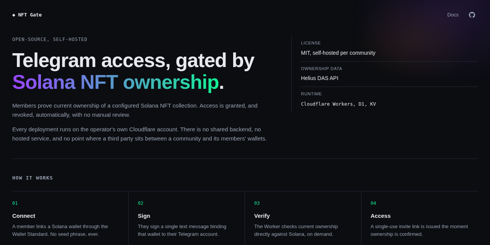

<div align="center">

# NFT Gate
[Landing page](https://nftgate.vsvn.net) · [Docs](https://nftgate.vsvn.net/docs)

**Gate a private Telegram group on verified Solana NFT ownership.**

[](./LICENSE)
[](https://github.com/psalm2517/telegram-nft-gate/actions/workflows/ci.yml)
[](https://www.typescriptlang.org)
[](https://workers.cloudflare.com)
[](https://github.com/psalm2517/telegram-nft-gate/stargazers)

</div>

---



A member proves they control a wallet holding at least one NFT from a configured
collection, and the bot grants them access. Ownership is re-checked on a
schedule; if it lapses, the member gets a grace period, a warning, and a chance
to re-verify before access is removed.

The whole system is a **single Cloudflare Worker** that serves the React
verification page, the verification API, and the Telegram webhook.
Administration (stats, search, revoke, restore, recheck) is a handful of
bot commands, not a separate dashboard.

> **Collection-agnostic.** The reference deployment gates on
> [Solana Business Frogs](#the-reference-collection), but nothing about that
> collection is hard-coded. Point `NFT_COLLECTION_ID` at your own collection and
> the software works unchanged.

---

## Deploy

[](https://deploy.workers.cloudflare.com/?url=https://github.com/psalm2517/telegram-nft-gate)

Forks the repo, provisions D1 and KV, and deploys the Worker. It can't create
your Telegram bot, validate your collection id, or register the webhook.
Those need your own Telegram/Solana context and are covered in
[Quick start](#quick-start) below.

---

## How it works

```
Telegram user
  │  /verify
  ▼
Telegram bot ──────────► personal, short-lived link
                              │
                              ▼
                    React app (served by the Worker)
                              │  connect wallet (Solana Wallet Standard)
                              ▼
                    POST /api/verify/challenge
                              │  server-issued, single-use challenge
                              ▼
                    wallet signs a plain message (no transaction)
                              │
                              ▼
                    POST /api/verify/submit
                              │
                    ┌─────────┴──────────┐
                    │ verify signature   │  ed25519, backend-only
                    │ burn nonce         │  atomic, single-use
                    │ query Helius DAS   │  owns ≥1 from collection?
                    └─────────┬──────────┘
                              ▼
                    D1 ──► single-use Telegram invite link
```

Three properties are worth calling out, because they are what make the gate
trustworthy:

- **The backend is authoritative.** The frontend never asserts who the user is
  or what they own. Identity comes from a signed token minted by the bot;
  ownership comes from a server-side DAS query using a key the browser never sees.
- **Ownership is tri-state.** A Helius timeout, 5xx, rate limit or malformed
  response is `INDETERMINATE`, never `NOT_OWNED`. An outage cannot revoke anyone.
- **No ordinary bypass.** Admins can revoke, and can restore a user *by
  re-proving ownership*, but there is no "grant access anyway" command.

---

## Quick start

```bash
pnpm install
cp .env.example .dev.vars     # then fill in real values
```

Create your Cloudflare resources:

```bash
pnpm exec wrangler d1 create telegram-nft-gate
pnpm exec wrangler kv namespace create KV
```

Both commands print an id. Put them in `wrangler.jsonc`, replacing the zero
placeholders. (If your fork is itself a public template, there's a gitignored
alternative: see [`deployment.md`](docs/deployment.md#1-create-resources).)

Validate your collection id against the chain **before** going live:

```bash
NFT_COLLECTION_ID=<your-collection-id> HELIUS_API_KEY=<key> pnpm run validate:collection <mintA> <mintB> <mintC>
```

Then run it:

```bash
pnpm run db:migrate:local && pnpm run build:web && pnpm run dev
```

Once deployed, register the webhook: the one setup step that can't be done
by messaging the bot, since it has no way to receive messages until this runs.

```bash
TELEGRAM_BOT_TOKEN=<token> pnpm run setup:telegram https://<your-worker>.workers.dev
```

After that, everything else, including which group to gate, is just
messaging the bot. Add it to your group as admin; it detects that and DMs your
admins to confirm via `/setup`. See
[`docs/telegram-setup.md`](docs/telegram-setup.md).

Full setup lives in [`docs/deployment.md`](docs/deployment.md), with Telegram
specifics in [`docs/telegram-setup.md`](docs/telegram-setup.md).

---

## Commands

| Command | What it does |
| --- | --- |
| `pnpm run dev` | Worker + API + frontend on `localhost:8787` |
| `pnpm run dev:web` | Vite dev server with HMR, proxying `/api` to `wrangler dev` |
| `pnpm run build` | Build frontend, then dry-run the Worker bundle |
| `pnpm test` | Vitest, running inside workerd against real D1/KV |
| `pnpm run typecheck` | Worker, frontend and scripts |
| `pnpm run lint` | ESLint across everything |
| `pnpm run db:migrate:local` | Apply D1 migrations to the local database |
| `pnpm run db:migrate:remote` | Apply D1 migrations to the deployed database |
| `pnpm run validate:collection` | Verify `NFT_COLLECTION_ID` against live DAS data |
| `pnpm run deploy` | Build the frontend and deploy the Worker |

---

## Configuration

Every value is an environment variable or Cloudflare secret. Nothing about a
specific collection or community is baked into the code. See
[`.env.example`](.env.example) for the annotated list.

| Secret | Purpose |
| --- | --- |
| `TELEGRAM_BOT_TOKEN` | Bot credential from @BotFather |
| `TELEGRAM_GROUP_ID` | The gated group's chat id. Optional: leave unset and confirm it by messaging the bot (`/setup`) instead |
| `TELEGRAM_WEBHOOK_SECRET` | Shared secret proving updates came from Telegram. Required: the webhook refuses all updates until it is set |
| `NFT_COLLECTION_ID` | Canonical on-chain certified collection id |
| `HELIUS_API_KEY` | DAS access, server-side only, never exposed. Required unless `DAS_ENDPOINT` points at another DAS-compatible provider |
| `ADMIN_TELEGRAM_IDS` | Telegram user ids allowed to run admin bot commands |
| `SESSION_SECRET` | Signs the short-lived tokens behind `/verify` links |

| Var | Default | Purpose |
| --- | --- | --- |
| `ACCESS_GRACE_PERIOD_HOURS` | `24` | Grace window after ownership is lost |
| `MIGRATION_MODE` | `true` | Protect pre-existing members from removal |
| `CHALLENGE_TTL_SECONDS` | `300` | Signing-challenge lifetime |
| `RECHECK_INTERVAL_HOURS` | `12` | How stale a check may get before re-running |
| `RECHECK_BATCH_SIZE` | `100` | Users re-checked per cron invocation |
| `JOIN_VERIFICATION_HOURS` | `1` | How long a member may stay unverified before removal |
| `PUBLIC_BASE_URL` | inferred | Origin used in generated links |
| `BRAND_ICON_URL` | none | Favicon and verify-page avatar. Purely cosmetic |
| `BRAND_SUCCESS_ICON_URL` | `BRAND_ICON_URL` | Image on the "verification complete" screen |

---

## Using a different collection

1. Find your collection's **canonical on-chain certified collection id**. Not a
   marketplace slug, name, symbol, creator address, candy machine address, or an
   individual mint. The reliable way is to take a few known mints from the
   collection and read their `grouping` from DAS `getAsset`.
2. Prove it, using the shipped validator:
   ```bash
   NFT_COLLECTION_ID=<id> HELIUS_API_KEY=<key> pnpm run validate:collection <mintA> <mintB> <mintC>
   ```
   It exits non-zero and explains the discrepancy if the id is not a collection
   asset, or if any sample mint groups elsewhere. It will never substitute a
   different id for you.
3. Set `NFT_COLLECTION_ID` and deploy.

Both Metaplex Token Metadata and MPL Core collections work: DAS abstracts the
difference, and the ownership query is identical for both.

## The reference collection

The first deployment gates on **Solana Business Frogs**:

```
J7rxtKmEpNJEtrfkagiTF1gsmLyVus6BQZFY4ouBkeMG
```

It is configuration, not code. See
[`docs/solana-verification.md`](docs/solana-verification.md) for how that id was
established and how to reproduce the check yourself.

---

## Documentation

- [`docs/architecture.md`](docs/architecture.md): components, data flow, schema, state machine
- [`docs/telegram-setup.md`](docs/telegram-setup.md): bot creation, permissions, webhook
- [`docs/solana-verification.md`](docs/solana-verification.md): collection ids, DAS, signature scheme
- [`docs/deployment.md`](docs/deployment.md): Cloudflare deployment, cron, migration procedure

## Security

- Wallet control is proven by an **off-chain message signature**. The app never
  requests a seed phrase, private key, or any transaction, and never stores key
  material of any kind.
- Challenges bind app identity, domain, Telegram user id, wallet address, a
  256-bit random nonce, and issue/expiry timestamps. They are single-use and
  burned atomically, so replay and substitution both fail.
- One wallet maps to at most one Telegram account, enforced by a unique index.
- Admin bot commands check `ADMIN_TELEGRAM_IDS` on every invocation and only
  work in a private chat; a non-admin gets a generic "Unknown command." reply
  rather than one that confirms the command exists.
- Every state transition and administrative action is written to an audit table.
- A leaked single-use invite link only ever admits one join, but that join
  isn't bound to the account the link was minted for. Anyone who joins without
  completing verification within `JOIN_VERIFICATION_HOURS` is removed.

Found a security issue? Please report it privately rather than opening a public
issue.

## AI disclosure

This project was built with AI assistance, directed by me.

## License

MIT. See [LICENSE](./LICENSE).

<div align="center">

[](https://cloudflare.com)

</div>
